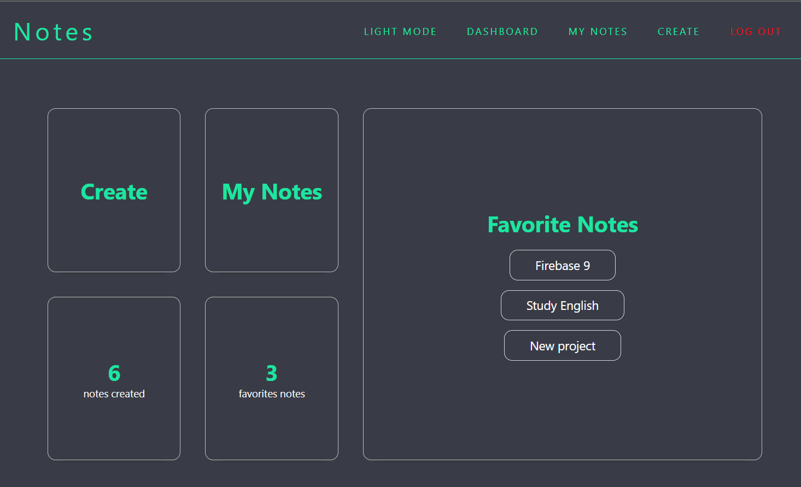
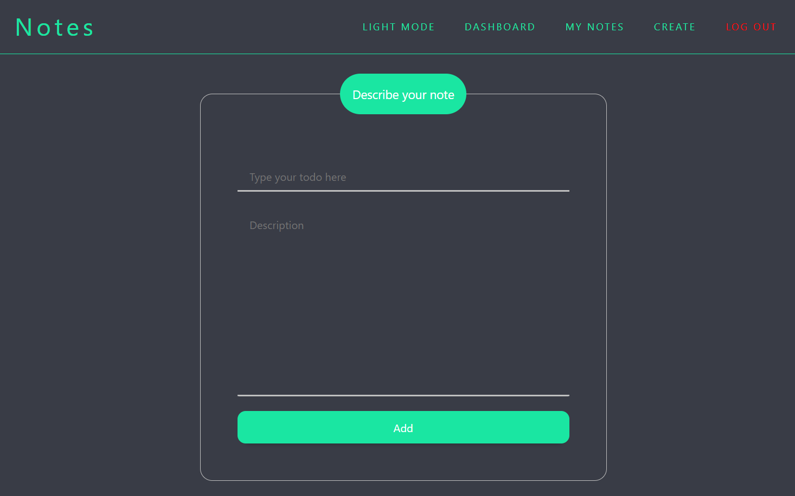
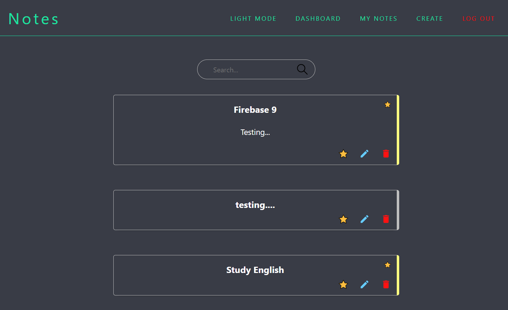
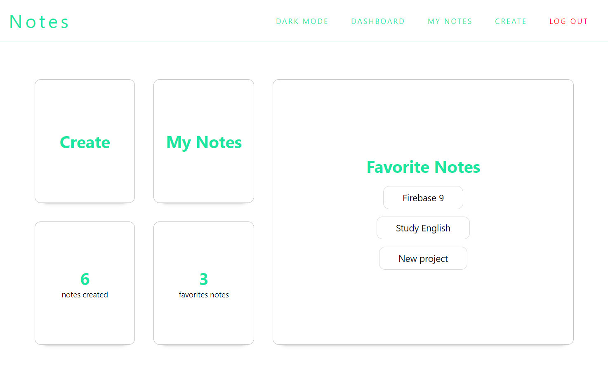

## Todo List VueJS 3

I'm implementing `Router` and `Firebase 9` on this project.

- [x] Firebase Authentication
- [x] Firebase CRUD
- [x] Search
- [x] Dark Mode

---

#### Routes

- Sign Up
- Dashboard
- Create Notes
- List Notes

---

### Images

#### `1 - Dashboard`

#### `2 - Create Notes`

#### `3 - List Notes`

#### `4 - Dashboard Light Mode`

---

### Setup project

`yarn` to install dependencies.

`yarn serve` to start project.
